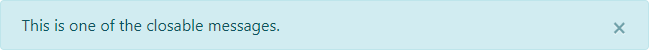

# Thymeleaf Bootstrap Messages

  [](https://sonarcloud.io/dashboard?id=jfermat_thymeleaf-bootstrap-messages) [](https://sonarcloud.io/dashboard?id=jfermat_thymeleaf-bootstrap-messages) [](https://sonarcloud.io/dashboard?id=jfermat_thymeleaf-bootstrap-messages)

This library helps to store different messages and render them with bootstrap components when using the Thymeleaf library.

## Requirements

Building the API client library requires:
1. Java 11+
2. Maven/Gradle

## Installation

To install the Messages Utils library to your local Maven repository, simply execute:

```shell
mvn clean install
```

### Maven users

Add this dependency to your project's POM:

```xml
<dependency>
  <groupId>io.github.jfermat</groupId>
  <artifactId>thymeleaf-bootstrap-messages</artifactId>
  <version>1.0.0</version>
  <scope>compile</scope>
</dependency>
```

### Gradle users

Add this dependency to your project's build file:

```groovy
compile "io.github.jfermat:thymeleaf-bootstrap-messages:1.0.0"
```

## Getting Started

Please follow the [installation](#installation) instruction and execute the following Java code:

## Documentation

### Java Documentation

See: https://jfermat.github.io/docs/thymeleaf-bootstrap-messages

### Bootstap Components

#### alerts

Provide contextual feedback messages for typical user actions with the handful of available and flexible alert messages.

**Attributes:**

Name | Default | Type | Description
--- | --- | --- | ---
context | default | String | Name of the context that will get the messages.
category | null | String | Name of the category that will get the messages.
closable | false | boolean | Allows you to close alerts.
escapeHtml | true | boolean | Escapes messages to HTML.
bundle | true | String | Bundle that you will get for translations.

**Example:**
```html
<!DOCTYPE html>
<html lang="en" xmlns:th="http://www.thymeleaf.org" xmlns:tbm="https://jfermat.github.io/bootstrapmessages">
<body>
    <tbm:alerts closable="true">This is where the messages will be rendered.</tbm:alerts>
</body>
</html>
```
*Result*



### Use with Spring Web MVC

First you have to create a component for the Bootstrap Messages Dialect where you have to define the prefix and processor precedence.
```java
package io.github.jfermat.example.dialect;

import io.github.jfermat.thymeleaf.bootstrap.messages.dialect.BootstrapMessagesAbstractDialect;
import org.springframework.stereotype.Component;

@Component
public class BootstrapMessagesDialect extends BootstrapMessagesAbstractDialect {

    public BootstrapMessagesDialect() {
        super("tbm", 1000);
    }
}
```

In the controller, in each mapping that you want to use the message store:

```java
package io.github.jfermat.example.controller;

import com.fasterxml.jackson.core.JsonProcessingException;
import io.github.jfermat.thymeleaf.bootstrap.messages.BootstrapMessages;
import org.springframework.stereotype.Controller;
import org.springframework.ui.Model;
import org.springframework.web.bind.annotation.GetMapping;
import org.springframework.web.bind.annotation.PostMapping;
import org.springframework.web.servlet.mvc.support.RedirectAttributes;

@Controller
public class ExampleController {
	
	@GetMapping("/")
	public String home(Model model) {
		BootstrapMessages.init(new SpringWebMVCInitializer(model));
		BootstrapMessages.defaultContext().addSuccessMessage("This success message.");
		return "home";
	}

	@PostMapping("/")
	public String homePost(RedirectAttributes redirectAttributes) {
		BootstrapMessages.init(new SpringWebMVCInitializer(redirectAttributes));
		BootstrapMessages.defaultContext().addInfoMessage("This info message.");
		return "redirect:/";
	}
}
```